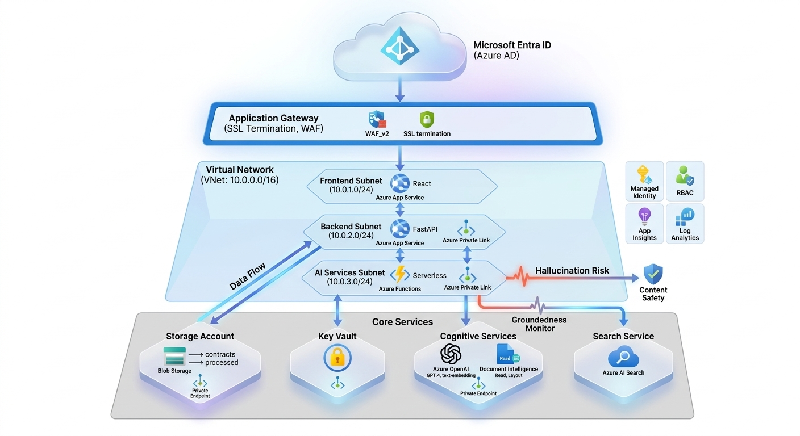
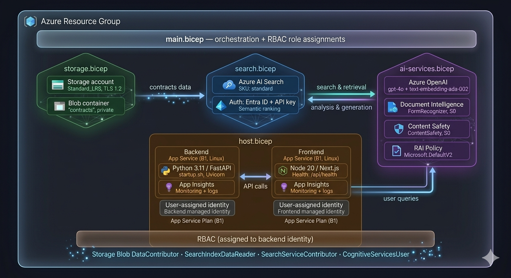

# DroitAI - CUAD Legal Contract Analysis System

<div align="center">
  
</div>


🏆 **Azure Innovation Challenge Entry** - Enterprise-grade legal contract analysis platform powered by CUAD (Contract Understanding Atticus Dataset) strategy and Azure AI.

A production-ready RAG system specialized for **legal contract analysis** with enterprise security, built for Azure with Next.js frontend and FastAPI backend.

## � Innovation Focus

- **CUAD Integration**: 41 legal clause types from Atticus dataset
- **Red Flag Detection**: AI-powered risk identification in contracts
- **One-Click Deployment**: Fully automated with data seeding
- **Enterprise Security**: Managed Identity with RBAC
- **Legal Intelligence**: Semantic search optimized for legal terminology

## �🏗️ Architecture
<div align="center">
  
</div>
DroitAI is a **full-stack legal AI system** with separate frontend and backend services:

### Frontend (Next.js)
- **Framework**: Next.js 15+ with App Router
- **Hosting**: Azure App Service (Node.js 20 LTS)
- **Authentication**: Entra ID SPA registration
- **Features**: Contract upload, clause filtering, red flag dashboard

### Backend (FastAPI) 
- **Framework**: FastAPI with async/await
- **Hosting**: Azure App Service (Python 3.11)
- **Authentication**: Entra ID Web API with OBO token flow
- **Features**: CUAD processing, legal search, AI analysis

### Azure Services
- **Authentication**: Entra ID with On-Behalf-Of (OBO) flow + Managed Identity
- **Search**: Azure AI Search with CUAD-optimized semantic ranking
- **AI**: Azure OpenAI (GPT-4o) for legal analysis
- **Document Processing**: Azure Document Intelligence (F0 tier)
- **Content Safety**: Azure Content Safety (F0 tier)
- **Storage**: Azure Storage with automated CUAD data seeding
- **Monitoring**: Application Insights + Log Analytics
- **Deployment**: Azure Developer CLI (azd) with Bicep

### CUAD Legal Intelligence
- **41 Clause Types**: Governing Law, Change of Control, Indemnification, etc.
- **Red Flag Detection**: Automated high-risk clause identification
- **Legal Analyzer**: Microsoft analyzer optimized for legal terminology
- **Semantic Search**: Legal context-aware search and ranking

## 🚀 Quick Start

### Prerequisites
- Azure CLI installed
- Azure Developer CLI (azd) installed
- Access to Azure subscription with Owner permissions

### 1. Clone Repository
```bash
git clone <repository>
cd droitai
```

### 2. Add Legal Contracts (Optional)
```bash
# Place your legal documents here for automated seeding
mkdir -p data/cuad-contracts
# Add your PDF/TXT contract files
cp your-contracts/*.pdf data/cuad-contracts/
```

### 3. One-Click Deployment
```bash
# Deploys infrastructure, uploads contracts, and starts applications
azd up
```

**That's it!** 🎉 Your legal contract analysis platform is ready with:
- ✅ Infrastructure provisioned
- ✅ CUAD contracts uploaded automatically
- ✅ Search index created and populated
- ✅ Applications running and secured

### 4. Access Your Platform
```bash
azd env get-values  # Get URLs and credentials
```

**Frontend**: Legal contract analysis interface  
**Backend API**: https://\<backend-app-name\>.azurewebsites.net/docs

## 🔧 Local Development

### Setup Environment
```bash
# Get Azure credentials
azd env get-values > .env.local

# Frontend
cd frontend
npm install
npm run dev

# Backend
cd backend
pip install -r requirements.txt
uvicorn app.main:app --reload --host 0.0.0.0 --port 8000
```

## 📁 Project Structure

```
/droitai
├── /frontend (Next.js 15+ App Router)
│   ├── /app
│   │   ├── /api/auth          # Entra ID authentication
│   │   ├── /chat              # Legal chat interface
│   │   └── layout.tsx         # Context providers
│   ├── /components
│   │   ├── /chat              # Legal message components
│   │   └── /legal              # CUAD clause filters
│   ├── /hooks                 # useChat, useOboToken
│   └── /lib                   # Client utilities

├── /backend (FastAPI)
│   ├── /app
│   │   ├── /api               # API routes (v1/chat, v1/ingest)
│   │   ├── /core              # Security, Config
│   │   ├── /services          # Business logic
│   │   │   ├── search_service.py    # CUAD-optimized search
│   │   │   ├── openai_service.py    # Legal analysis AI
│   │   │   ├── docintel_service.py  # Document Intelligence
│   │   │   └── safety_service.py    # Content Safety
│   │   └── main.py
│   ├── /evaluators            # Responsible AI metrics
│   └── /models                # Pydantic schemas

├── /infra (Infrastructure as Code)
│   ├── main.bicep            # Azure resources orchestration
│   ├── /modules
│   │   ├── search.bicep       # CUAD-optimized search index
│   │   ├── storage.bicep      # Azure Storage
│   │   ├── ai-services.bicep  # OpenAI, Document Intelligence
│   │   └── monitoring.bicep   # App Insights, Log Analytics
│   └── azure.yaml            # AZD service configuration

├── /data/cuad-contracts/      # Legal documents for seeding
├── /scripts
│   ├── sync-data.ps1         # Windows data upload script
│   ├── sync-data.sh          # Linux/Mac data upload script
│   └── test-env.ps1          # Environment verification

└── README.md                  # This file
```

## 🔐 Security Features

### Enterprise Security
- **Managed Identity**: Zero secrets, Azure AD RBAC only
- **Separate Identities**: Frontend and backend with dedicated Entra ID apps
- **OBO Token Flow**: Secure token exchange between services
- **Least Privilege Access**: Granular role assignments
- **Network Security**: Storage with deny-by-default, HTTPS only
- **Content Safety**: Built-in legal content filtering

### Compliance
- **Data Encryption**: All contracts encrypted at rest and in transit
- **Audit Logging**: Complete legal document access trail
- **CORS Configuration**: Secure cross-origin resource sharing

- **Token Validation**: Both frontend and backend validate tokens

## 🌟 Key Features

### Legal Intelligence
- **CUAD Analysis**: 41 clause types automatically identified
- **Red Flag Detection**: AI-powered risk assessment
- **Legal Semantic Search**: Context-aware contract search
- **Faceted Filtering**: Filter by clause types, risk level, document
- **Document Intelligence**: PDF, Word, and image processing

### Enterprise Features
- **One-Click Deployment**: Automated infrastructure and data seeding
- **Managed Identity**: Production-ready security without API keys
- **Scalable Architecture**: Microservices with container support
- **Responsible AI**: Legal evaluation metrics and governance
- **Developer Experience**: Full local development with Docker

### CUAD Clause Types (41 Categories)
- Governing Law, Change of Control, Indemnification
- Limitation of Liability, Warranty Duration, Confidentiality
- Non-Compete, Assignment, Termination for Convenience
- And 32 more specialized legal clause types

## � Cost Optimization

- **Free Tiers**: Search (Free), Document Intelligence (F0), Content Safety (F0)
- **Basic Tiers**: App Service (B1), Storage (Standard_LRS)
- **Pay-as-you-go**: OpenAI (S0) with usage-based billing
- **Monitoring**: Free tier for Application Insights and Log Analytics

## �🛠️ Development Workflows

### Infrastructure Changes
```bash
# Preview infrastructure changes
azd provision --preview

# Deploy infrastructure only
azd provision

# Deploy application only
azd deploy
```

### Data Management
```bash
# Add new contracts
cp new-contracts/*.pdf data/cuad-contracts/
azd up  # Re-deploys with new data

# Clear and reseed data
rm -rf data/cuad-contracts/*
azd up
```

## 📊 Monitoring & Observability

- **Application Insights**: Legal document processing tracking
- **Log Analytics**: Centralized legal audit logging
- **Health Checks**: Application and legal service monitoring
- **Error Tracking**: Comprehensive legal AI error reporting

## � Innovation Challenge Highlights

### Automation Excellence
- **Zero Manual Steps**: Contracts uploaded during deployment
- **Idempotent Operations**: Safe re-deployment with data preservation
- **Cross-Platform**: Works on Windows, Linux, and Mac

### Security Innovation
- **Keyless Architecture**: No API keys or secrets in code
- **RBAC-First**: Role-based access control throughout
- **Identity-Based**: Uses Azure AD identities exclusively

### Legal AI Innovation
- **CUAD Integration**: Industry-standard legal clause dataset
- **Semantic Legal Search**: Optimized for legal terminology
- **Risk Intelligence**: Automated red flag identification

## 📚 Documentation

### Presentations & Overviews
- [🎯 DroitAI Presentation](./docs/DroitAI-AI-Powered-Legal-Contract-Analysis.pptx) - Complete project overview and architecture

### Technical Guides
- [📋 CUAD Data Guide](./data/cuad-contracts/README.md) - Contract data structure
- [🔧 Deployment Guide](./DEPLOYMENT.md) - Step-by-step deployment
- [📖 API Documentation](https://\<backend-app-name\>.azurewebsites.net/docs) - Interactive API docs

## 📚 Architecture Documentation

### Security & Authentication
- **[Azure AD App Registration Setup](docs/azure-ad-app-registration.md)** - Configure frontend and backend app registrations
- **[Permission Grants & Admin Consent](docs/permission-grants.md)** - Required API permissions and consent workflow
- **[OBO Token Flow Architecture](docs/obo-token-flow.md)** - On-Behalf-Of token exchange between services
- **[Managed Identity Configuration](docs/managed-identity.md)** - Keyless authentication setup

### Infrastructure & Deployment
- **[Azure Architecture Overview](docs/azure-architecture.md)** - Complete infrastructure diagram and components
- **[Bicep Infrastructure as Code](docs/bicep-infrastructure.md)** - Infrastructure deployment and customization
- **[Networking & Security](docs/network-security.md)** - VNet, private endpoints, and security groups
- **[Monitoring & Observability](docs/monitoring.md)** - Application Insights and Log Analytics setup

### Application Architecture
- **[Microservices Design](docs/microservices.md)** - Frontend, backend, and AI service architecture
- **[Data Processing Pipeline](docs/data-pipeline.md)** - Document ingestion and vector indexing
- **[Legal AI Integration](docs/legal-ai-integration.md)** - OpenAI, Document Intelligence, and Content Safety
- **[CUAD Dataset Integration](docs/cuad-integration.md)** - Legal clause analysis and red flag detection

### Development & Operations
- **[Local Development Setup](docs/local-development.md)** - Docker, environment configuration, and debugging
- **[Testing Strategy](docs/testing.md)** - Unit tests, integration tests, and legal AI validation
- **[Deployment Automation](docs/deployment-automation.md)** - AZD workflows and CI/CD pipeline
- **[Troubleshooting Guide](docs/troubleshooting.md)** - Common issues and solutions

## 🤝 Contributing

1. Fork the repository
2. Create a feature branch
3. Test with `azd up`
4. Submit a pull request

## 📄 License

MIT License - see LICENSE file for details

---

🏆 **Built for Azure Innovation Challenge 2026**  
🔒 **Enterprise-Grade Legal AI with CUAD Integration**  
🚀 **One-Click Deployment with Automated Data Seeding**
