# Azure Architecture Overview

This document provides a comprehensive overview of the Azure architecture for the Droit AI RAG system, including infrastructure components, networking, security, and data flow.

## Architecture Diagram

```
┌─────────────────────────────────────────────────────────────────────────────────┐
│                                    Azure AD Tenant                              │
├─────────────────────────────────────────────────────────────────────────────────┤
│                                                                                 │
│  ┌─────────────┐    ┌─────────────┐    ┌─────────────┐    ┌─────────────┐      │
│  │ Frontend    │    │ Backend     │    │ AI Service  │    │ Monitoring  │      │
│  │ App Service │    │ App Service │    │ Functions   │    │ App Insights│      │
│  │ (React)     │    │ (FastAPI)   │    │ (Serverless)│    │             │      │
│  │ System ID   │    │ System ID   │    │ User ID     │    │             │      │
│  └─────────────┘    └─────────────┘    └─────────────┘    └─────────────┘      │
│         │                   │                   │                   │            │
│         └───────────────────┼───────────────────┼───────────────────┘            │
│                             │                   │                                │
│  ┌─────────────────────────────────────────────────────────────────────────┐    │
│  │                        Application Gateway                              │    │
│  │                    (SSL Termination, WAF)                               │    │
│  └─────────────────────────────────────────────────────────────────────────┘    │
│                             │                                                      │
│  ┌─────────────────────────────────────────────────────────────────────────┐    │
│  │                           Virtual Network                               │    │
│  │  ┌─────────────┐    ┌─────────────┐    ┌─────────────┐                 │    │
│  │  │ Frontend    │    │ Backend     │    │ AI Service  │                 │    │
│  │  │ Subnet      │    │ Subnet      │    │ Subnet      │                 │    │
│  │  │ (10.0.1.0/24)│  │ (10.0.2.0/24)│  │ (10.0.3.0/24)│                 │    │
│  │  └─────────────┘    └─────────────┘    └─────────────┘                 │    │
│  └─────────────────────────────────────────────────────────────────────────┘    │
│                             │                                                      │
│  ┌─────────────────────────────────────────────────────────────────────────┐    │
│  │                        Core Services                                    │    │
│  │  ┌─────────────┐  ┌─────────────┐  ┌─────────────┐  ┌─────────────┐     │    │
│  │  │   Storage   │  │   Key Vault │  │ Cognitive   │  │   Search    │     │    │
│  │  │   Account   │  │             │  │ Services    │  │   Service   │     │    │
│  │  │             │  │             │  │             │  │             │     │    │
│  │  └─────────────┘  └─────────────┘  └─────────────┘  └─────────────┘     │    │
│  └─────────────────────────────────────────────────────────────────────────┘    │
│                                                                                 │
└─────────────────────────────────────────────────────────────────────────────────┘
```

## Infrastructure Components
<div align="center">
  
</div>
### 1. Compute Services

#### Frontend App Service
- **Purpose**: React frontend application
- **Runtime**: Node.js 18 LTS
- **Scaling**: Manual/Auto-scale (1-10 instances)
- **Identity**: System-assigned managed identity
- **Features**: 
  - Always On enabled
  - HTTPS only
  - VNet integration
  - Application Gateway integration

#### Backend App Service
- **Purpose**: FastAPI backend service
- **Runtime**: Python 3.11
- **Scaling**: Manual/Auto-scale (1-5 instances)
- **Identity**: System-assigned managed identity
- **Features**:
  - Always On enabled
  - HTTPS only
  - VNet integration
  - Private endpoints for storage

#### AI Functions
- **Purpose**: Serverless AI processing
- **Runtime**: Python 3.11
- **Trigger**: HTTP and Queue triggers
- **Identity**: User-assigned managed identity
- **Features**:
  - Consumption plan
  - VNet integration
  - Private endpoints

### 2. Storage Services

#### Azure Storage Account
- **Type**: StorageV2 (General Purpose v2)
- **Replication**: Geo-redundant storage (GRS)
- **Performance**: Standard
- **Containers**:
  - `contracts`: Legal documents (PDF, Word, images)
  - `processed`: Processed document embeddings
  - `temp`: Temporary processing files
- **Security**: Private endpoints, deny-by-default

#### Azure Search Service
- **Tier**: Basic (development) / Standard (production)
- **Replicas**: 1 (development) / 3 (production)
- **Partitions**: 1 (development) / 3 (production)
- **Features**:
  - Semantic search
  - Vector search
  - Custom analyzers for legal text

### 3. AI & Cognitive Services

#### Azure OpenAI
- **Models**: GPT-4, text-embedding-ada-002
- **Region**: Same as other resources
- **Quotas**: Configured based on expected usage
- **Security**: Private endpoints, managed identity

#### Document Intelligence
- **Features**: Layout analysis, text extraction
- **Models**: Read, prebuilt-document
- **Security**: Private endpoints, managed identity

#### Content Safety
- **Features**: Content filtering, hate speech detection
- **Security**: Private endpoints, managed identity

### 4. Security & Identity

#### Azure Active Directory
- **Tenant**: Dedicated tenant for Droit AI
- **App Registrations**: Frontend and backend apps
- **Authentication**: OAuth 2.0 + OBO flow
- **Features**: Conditional access, MFA support

#### Key Vault
- **Purpose**: Secret management and encryption keys
- **Features**: Soft delete, purge protection
- **Access**: Managed identity only
- **Security**: Private endpoints, RBAC

### 5. Networking

#### Virtual Network (VNet)
- **Address Space**: 10.0.0.0/16
- **Subnets**:
  - Frontend: 10.0.1.0/24
  - Backend: 10.0.2.0/24
  - AI Services: 10.0.3.0/24
- **Features**: Service endpoints, private endpoints

#### Application Gateway
- **Tier**: WAF_v2
- **Features**: SSL termination, WAF rules, path-based routing
- **Security**: OWASP 3.2 rules, DDoS protection

### 6. Monitoring & Observability

#### Application Insights
- **Purpose**: Application monitoring and diagnostics
- **Features**: 
  - Request tracking
  - Exception monitoring
  - Performance counters
  - Dependency tracking

#### Log Analytics
- **Purpose**: Centralized logging
- **Features**: Custom queries, alert rules, log retention

## Data Flow Architecture

### 1. User Authentication Flow
```
User → Frontend → Azure AD → Frontend → Backend → Token Validation → API Access
```

### 2. Document Processing Flow
```
User Upload → Frontend → Backend → Storage Queue → AI Functions → 
Document Intelligence → OpenAI Embeddings → Search Index → Storage
```

### 3. Query Processing Flow
```
User Query → Frontend → Backend → Search Service → OpenAI → Response → Frontend
```

## Security Architecture

### 1. Network Security
- **VNet Isolation**: All services in private VNet
- **Private Endpoints**: Storage, Key Vault, Cognitive Services
- **NSG Rules**: Restrictive inbound/outbound rules
- **WAF Protection**: Application Gateway with OWASP rules

### 2. Identity Security
- **Managed Identity**: No secrets in application code
- **RBAC**: Least privilege access control
- **Conditional Access**: MFA, location-based policies
- **Token Security**: Short-lived tokens, secure storage

### 3. Data Security
- **Encryption**: At rest and in transit
- **Access Control**: Role-based, least privilege
- **Audit Logging**: Complete access trail
- **Data Classification**: Legal document handling

## High Availability & Disaster Recovery

### 1. Availability Zones
- **App Services**: Zone-redundant (production)
- **Storage**: Geo-redundant storage (GRS)
- **Search Service**: Multi-region replication (production)

### 2. Backup Strategy
- **Storage**: Azure Backup for critical data
- **Search Index**: Automated snapshots
- **Configuration**: Infrastructure as Code (Bicep)

### 3. Monitoring & Alerting
- **Health Checks**: Application and service health
- **Performance Metrics**: Response times, error rates
- **Alert Rules**: Critical issue notifications

## Cost Optimization

### 1. Resource Sizing
- **App Services**: App Service Plans with appropriate tiers
- **Storage**: Tiered storage based on usage
- **AI Services**: Pay-as-you-go with quotas

### 2. Cost Management
- **Budgets**: Azure Cost Management budgets
- **Alerts**: Cost anomaly detection
- **Optimization**: Right-sizing based on usage

### 3. Free Tiers Utilization
- **Search Service**: Free tier for development
- **App Service**: Free tier for testing
- **Storage**: Free tier for small deployments

## Deployment Architecture

### 1. Infrastructure as Code
- **Bicep Templates**: All infrastructure defined in code
- **Parameter Files**: Environment-specific configurations
- **Modular Design**: Separated by service/component

### 2. CI/CD Pipeline
- **Azure DevOps**: Build and release pipelines
- **Automated Testing**: Unit, integration, and security tests
- **Environment Promotion**: Dev → Test → Prod

### 3. Deployment Automation
- **AZD Templates**: Azure Developer CLI templates
- **Scripts**: PowerShell and Bash deployment scripts
- **Validation**: Pre and post-deployment validation

## Performance Optimization

### 1. Caching Strategy
- **Frontend**: Static content caching via CDN
- **Backend**: Redis cache for frequently accessed data
- **Search**: Query result caching

### 2. Scaling Strategy
- **Horizontal Scaling**: Auto-scale based on metrics
- **Load Balancing**: Application Gateway distribution
- **Resource Optimization**: Performance tuning

### 3. Database Optimization
- **Search Index**: Optimized schema and queries
- **Storage Performance**: Optimized blob access patterns
- **AI Services**: Batch processing and model optimization

## Compliance & Governance

### 1. Compliance Standards
- **GDPR**: Data protection and privacy
- **SOC 2**: Security and availability controls
- **ISO 27001**: Information security management

### 2. Governance Policies
- **Resource Naming**: Consistent naming conventions
- **Tagging Strategy**: Cost allocation and management
- **Access Policies**: Regular access reviews

### 3. Audit & Reporting
- **Activity Logs**: Azure AD and resource logs
- **Compliance Reports**: Regular compliance assessments
- **Security Reports**: Monthly security posture

## Next Steps

1. [Bicep Infrastructure as Code](./bicep-infrastructure.md) - Detailed IaC implementation
2. [Network Security Configuration](./network-security.md) - VNet and security setup
3. [Monitoring & Observability](./monitoring.md) - Comprehensive monitoring setup

## References

- [Azure Architecture Center](https://docs.microsoft.com/en-us/azure/architecture/)
- [Azure Well-Architected Framework](https://docs.microsoft.com/en-us/azure/architecture/framework/)
- [Azure Security Best Practices](https://docs.microsoft.com/en-us/azure/security/)
